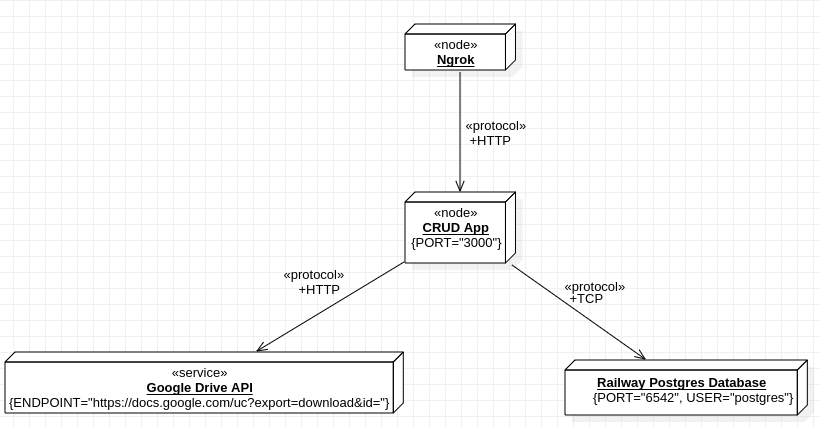
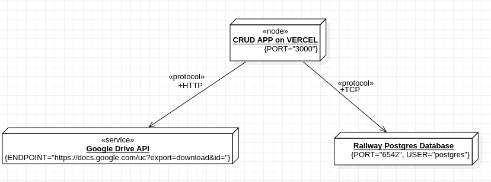

# CRUD Productos
## Descripción de la aplicación
Esta aplicación es un CRUD de productos creada con NextJS, React y Typescript, que usa como motor de base de datos Postgresql y consume el contenido de un archivo de texto plano alojado en Google Drive. La aplicación puede ser desplegada a través de cualquier servicio. Se explica cómo hacerlo usando Ngrok desde nuestra maquina local y con Vercel usando su plataforma.
## Requisitos
Tener instalado:
- [Nodejs](https://nodejs.org/en/)
- Algún manejador de paquetes (**npm, pnpm, yarn**), recomendamos **pnpm**.
- [Git](https://git-scm.com/)
- Una cuenta en [Ngrok](https://ngrok.com/)
- El [CLI de Ngrok](https://ngrok.com/download) para poder exponer nuestra aplicación a internet. *Este y los pasos anteriores es si decidimos exponer la aplicación desde nuestro maquina local.*
- Una cuenta en [Vercel](https://vercel.com/) y hacerle fork a este repositorio si queremos desplegarlo por Vercel.
### Paquetes que se usan en el proyecto
#### Producción
- Axios, para hacer peticiones HTTP.
- NextJS, framework de React para crear páginas y/o aplicativos web.
- pg, para interacturar con una base de datos Postgresql desde nodejs.
- React, para crear interfaces de usuario.
- react-hot-toast, para tener componetes de notificación ya creados.
#### Desarrollo
- Typescript, para tener los beneficios de un lenguaje tipado.
- Tailwind, un framework de CSS para dar estilos a nuestras interfaces.
## Diagrama de despliegue usando nuestra maquina local con Ngrok

## Diagrama de despliegue usando Vercel

## Descargando el código de la aplicación
Desde nuestra terminal de comandos de preferencia, clonamos este repositorio:
```bash
git clone https://github.com/wFercho/crud-productos
```
Una vez clonado el repositorio (descargado), ingresamos en la carpeta del proyecto:
```bash
cd crud-productos
```
### Estructura general de carpetas y archivos del proyecto
```mk
- /.next
- /node_modules
- /public
- /src
	- /components
	- /config
		- /env
	- /database
	- /pages
		- /products
			- /edit
		- /api
	- /server
		- /controllers
		- /services
	- /styles
	- /types
- .env.example
- .eslintrc.json
- .gitignore
- next.config.js
- package.json
- postcss.config.js
- tailwind.config.js
- tsconfig.json

```

Luego, instalamos los paquetes estando en la carpeta del proyecto:
```bash
pnpm install
# or
npm install
# or
yarn install
```

### Configurar la conexión a base de datos remota (Postgresql)
Una vez descargado el proyecto, con todos los paquetes instalados que fueron descritos anteriormente, podemos pasar a configurar la conexión con una base de datos remota, en este caso usaremos Postgreslq.  

Haciendo uso de [Railway](https://railway.app/), crearemos un nuevo proyecto con una base de datos Postgresql.


Estas son las variables que usaremos para conectarnos a la base de datos que acabamos de crear.  

Tomando como base los nombres de variables de entorno que están en el archivo .env.example, creamos un archivo con el nombre  ".env.local", en el que definiremos nuestras variabales de entorno.
```yaml
DB_PORT=
DB_HOST=
DB_USER=
DB_PASSWORD=
DB_NAME=
ID_ARCH_PLANO_DRIVE =
SERVER=
##SERVER solo la definimos si desplegamos en Vercel u otra plataforma diferente, o cuando usamos ngrok para exponer nuestra maquina local
```
En el archivo que acabamos de crear colocamos las variables que tenemos en railway.  

La aplicación de CRUD de productos automáticamente creará la tabla "product" en la base de datos que acabamos de crear. Por lo que solo nos tenemos que encargar de ingresar las variables de entorno para lograr la conexión con la base de datos.

### Configurando la conexión a un archivo externo (Google Drive)
Para consumir el contenido de un archivo de texto plano que esté alojado en Google Drive: 
1. Creamos un enlace para compartir la vista del documento.

2. De ese enlace inferimos el ID del documento
"https://drive.google.com/file/d/1LSQzDmTCWe3aIL9fkve9lvSEjKdfCHQg/view". 
Para este caso (siendo 19 de Febrero de 2023), así es como se ve el enlace para la vista del documento. El ID es el que se encuentra después del **"d/"** y va hasta el siguiente **"/"**, en este caso sería "**1LSQzDmTCWe3aIL9fkve9lvSEjKdfCHQg**". Este va en la variable de entorno "**ID_ARCH_PLANO_DRIVE**".
## Ejecutando la apliación en desarrollo
Para comprobar que las conexiones a los servicios remotos se hicieron con éxito, podemos ejecutar nuestra aplicación en el entorno de desarrollo, para esto hacemos uso del siguiente comando en nuetra terminal.
```bash
pnpm run dev
# or
npm run dev
# or
yarn run dev
```
Usando nuestro navegador de preferencia accedemos a:

 [http://localhost:3000/](http://localhost:3000/) 
## Desplegando la aplicación usando Ngrok
Ejecutamos el CLI de ngrok para exponer nuestra aplicación
```bash
ngrok http 3000
```
Siendo **http** el protocolo que usamos y **3000** el puerto donde se  está ejecutando la aplicación.

Posteriormente configuramos nuestra variable de entorno ser servidor **SERVER** de nuestro archivo .env.local
```bash
# En este caso sería "https://ca56-191-95-172.8.ngrok.io"

#./env.local
SERVER=
``` 
Hacemos build.
```bash
pnpm run build
# or
npm run build
# or
yarn run build
```
Luego de esto podemos ejecutar la aplicación:
```bash
pnpm run start
# or
npm run start
# or
yarn run start
```
Finalmente para acceder a nuestra aplicación desde internet usamos la **URL** 	que Ngrok nos generó. (El siguiente es un ejemplo de lo que veriamos al ejecutar ngrok exponiendo por http el la aplicación que está ejecutandose en el puerto 3000)

## Desplegando la aplicación usando Vercel
A diferencia de como se explicó para exponer la aplicación a internet de forma local usando Ngrok, acá todo el proceso lo hacemos usando la plataforma de Vercel.  
1. Debemos tener una cuenta en GitHub, para que de esta forma podamos hacerle fork a este repositorio.
2. Una vez hecho el fork, y ya teniendo nuestra cuenta en Vercel, creamos un proyecto en esta.

3. Importamos el repositorio que creamos haciendole fork a este.


4. Una vez seleccionado el repositorio, pasamos a configurar las variables de entorno. 


Estando acá tenemos que estar atentos de ingresar correctamente los nombres de las variables de entorno que podemos ver en el archivo ".env.example" con sus respectivos valores. Una vez hecho esto podemos hacer Deploy.

**NOTA**: La variable de entorno *SERVER* se agrega después de hacer el deploy, ya que necesitamos que Vercel nos genere el Domain.

En este caso la URL es la que encontramos abajo de "DOMAINS", la copiamos y luego nos vamos a las settings que encontramos en la parte superior de la página de Vercel estando en la ventana de nuestro proyecto, luego en la parte izquierda encontramos el apartado de "Environment Varaibles", entramos. Ya estando ahí definimos la variable de entorno *SERVER* con la URL que acabamos de copiar.